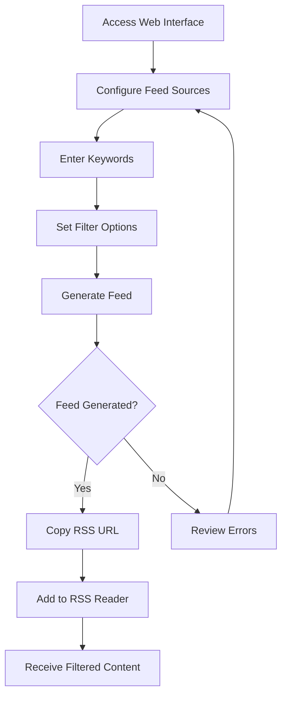
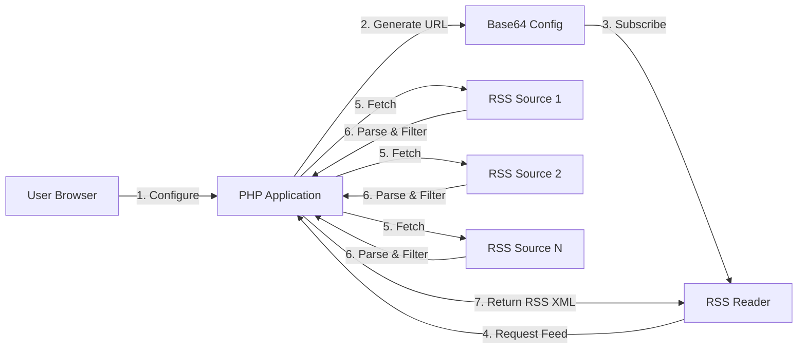
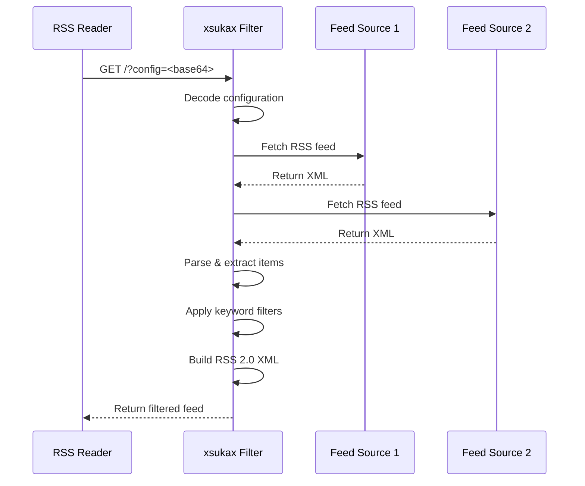

# xsukax RSS Filter

A powerful, privacy-focused RSS feed aggregator and filter that enables dynamic filtering of multiple RSS sources based on custom keywords. Generate personalized RSS feeds with base64-encoded configurations for reliable, server-side processing.

## Project Overview

xsukax RSS Filter is a self-hosted PHP application designed to aggregate multiple RSS feeds and filter their content based on user-defined keywords. Unlike traditional RSS readers, this tool generates custom RSS feed URLs that can be subscribed to in any standard RSS reader application. The filtering logic operates entirely server-side, ensuring real-time content updates and consistent results across all platforms.

The application employs a stateless architecture where feed configurations are encoded directly into the URL, eliminating the need for databases or persistent storage. This design ensures portability, simplicity, and enhanced privacy for users who want granular control over their RSS consumption.

**Key Capabilities:**
- Aggregate unlimited RSS sources into a single filtered feed
- Filter by keywords with OR logic (matches any keyword)
- Choose between title-only or full-content search modes
- Preserve complete RSS metadata including categories, authors, Dublin Core elements, and enclosures
- Generate shareable, self-contained feed URLs

## Security and Privacy Benefits

xsukax RSS Filter prioritizes user privacy and security through its architectural design and implementation:

### Privacy-First Architecture
- **No Data Collection**: The application stores no user data, browsing history, or feed preferences. All configuration is encoded in the feed URL itself.
- **Stateless Design**: No databases, sessions, or cookies are used. Each request is independent and leaves no server-side footprint.
- **Self-Hosted Control**: Deploy on your own infrastructure to maintain complete control over data flow and processing.
- **No Third-Party Dependencies**: Apart from Tailwind CDN for styling the configuration interface, the application operates entirely independently without external API calls or tracking services.

### Security Measures
- **Base64 URL Encoding**: Feed configurations are base64-encoded to ensure URL safety and prevent injection attacks through malformed parameters.
- **Input Validation**: All user-supplied URLs are validated using PHP's `filter_var()` with `FILTER_VALIDATE_URL` before processing.
- **XML Output Sanitization**: All dynamic content in generated RSS feeds is properly escaped using `htmlspecialchars()` with `ENT_XML1` flags or wrapped in CDATA sections.
- **Error Suppression**: Clean error handling prevents information disclosure about server configuration or file paths.
- **Isolated Processing**: Each feed source is fetched and processed independently with exception handling to prevent one malicious feed from affecting others.

### Operational Security
- **Custom User Agent**: Identifies requests as "xsukax RSS Filter" for transparency with source servers.
- **Timeout Protection**: 30-second timeout on feed fetches prevents resource exhaustion from slow or unresponsive sources.
- **No Persistent Connections**: Each feed generation creates fresh connections, preventing session hijacking or state manipulation.

## Features and Advantages

### Core Features
- **Multi-Source Aggregation**: Combine feeds from blogs, news sites, forums, and any RSS-compliant source into a unified stream
- **Flexible Keyword Filtering**: Define multiple comma-separated keywords with case-insensitive matching across titles, descriptions, and full content
- **Search Mode Options**: Toggle between title-only filtering (faster, more precise) or full-content search (comprehensive, catches more matches)
- **Complete Metadata Preservation**: Maintains all RSS elements including Dublin Core creator information, categories, GUIDs, publication dates, comments, and media enclosures
- **Namespace Support**: Handles content:encoded, dc:creator, wfw:commentRss, slash:comments, and other extended RSS namespaces

### Technical Advantages
- **Single-File Deployment**: No complex installation procedures or dependency management—upload one PHP file and configure your web server
- **Base64 Configuration Storage**: Feed parameters are encoded in the URL, making feeds portable, shareable, and bookmark-friendly
- **Real-Time Content**: Every feed request fetches fresh content from sources, ensuring you never miss updates
- **Standards Compliant**: Generates valid RSS 2.0 XML with proper namespace declarations and atom:link self-references
- **Responsive Web Interface**: Clean, mobile-friendly configuration form built with Tailwind CSS

### User Experience Benefits
- **Visual Statistics Dashboard**: See total items, matched items, and processed sources at a glance
- **Live Feed Preview**: Test your filtered feed directly in the browser before adding to your RSS reader
- **Error Reporting**: Detailed feedback when sources fail to fetch or parse, helping troubleshoot configuration issues
- **One-Click Copy**: Copy generated feed URLs instantly to clipboard
- **No Account Required**: Start filtering feeds immediately without registration or authentication

### Use Cases
- Monitor multiple technology blogs for specific programming languages or frameworks
- Aggregate news sources while filtering for particular topics, people, or events
- Track scientific publications or preprint servers for relevant research keywords
- Follow industry forums or subreddits for targeted discussions
- Create curated news feeds for teams or communities without manual curation

## Installation Instructions

### Prerequisites

Ensure your server environment meets these requirements:

- **PHP**: Version 7.0 or higher (tested on PHP 7.4 and 8.x)
- **PHP Extensions**:
  - `curl`: For fetching remote RSS feeds
  - `simplexml`: For parsing RSS XML content
  - `json`: For configuration encoding (typically enabled by default)
- **Web Server**: Apache, Nginx, or any PHP-capable web server
- **SSL/TLS Certificate**: Recommended for HTTPS deployment (optional but strongly advised)

### Step-by-Step Installation

1. **Download the Application**
   ```bash
   # Clone the repository
   git clone https://github.com/xsukax/xsukax-RSS-Filter.git
   
   # Or download directly
   wget https://raw.githubusercontent.com/xsukax/xsukax-RSS-Filter/main/xsukax-rss-filter.php
   ```

2. **Upload to Web Server**
   - Transfer `xsukax-rss-filter.php` to your web server's document root or desired subdirectory
   - Example locations:
     - Apache: `/var/www/html/rss-filter/`
     - Nginx: `/usr/share/nginx/html/rss-filter/`
     - Shared hosting: `public_html/rss-filter/`

3. **Set File Permissions**
   ```bash
   # Ensure the PHP file is readable and executable by the web server
   chmod 644 xsukax-rss-filter.php
   
   # If placing in a dedicated directory
   chmod 755 /path/to/rss-filter/
   ```

4. **Configure Web Server (Optional)**
   
   **Apache (.htaccess)**
   ```apache
   # Enable clean URLs if desired
   RewriteEngine On
   RewriteBase /rss-filter/
   ```

   **Nginx (server block)**
   ```nginx
   location /rss-filter/ {
       index xsukax-rss-filter.php;
       try_files $uri $uri/ /rss-filter/xsukax-rss-filter.php?$query_string;
   }
   ```

5. **Verify Installation**
   - Navigate to `https://yourdomain.com/path/to/xsukax-rss-filter.php`
   - You should see the configuration interface with a "PHP is Working!" message
   - The message displays your PHP version and server software

6. **Security Hardening (Recommended)**
   ```bash
   # Restrict access via .htaccess (Apache)
   echo "Require ip YOUR.IP.ADDRESS" > .htaccess
   
   # Or use HTTP authentication
   htpasswd -c .htpasswd yourusername
   ```

### Docker Deployment (Alternative)

For containerized deployment:

```dockerfile
FROM php:8.1-apache
RUN docker-php-ext-install curl
COPY xsukax-rss-filter.php /var/www/html/index.php
EXPOSE 80
```

```bash
docker build -t xsukax-rss-filter .
docker run -d -p 8080:80 xsukax-rss-filter
```

### Troubleshooting Installation

| Issue | Solution |
|-------|----------|
| "500 Internal Server Error" | Check PHP error logs; verify PHP version ≥7.0 |
| Blank page | Ensure `display_errors` is enabled during setup: `ini_set('display_errors', '1');` |
| cURL errors | Verify `php-curl` extension is installed: `php -m \| grep curl` |
| XML parsing fails | Install `php-xml` package: `apt install php-xml` or `yum install php-xml` |

## Usage Guide

### Basic Workflow



### Step 1: Access Configuration Interface

Navigate to your installation URL in a web browser:
```
https://yourdomain.com/xsukax-rss-filter.php
```

### Step 2: Configure RSS Sources

1. **Add Feed Sources**: Click the "+ Add" button to include multiple RSS feed URLs
   - Example: `https://blog.example.com/feed.xml`
   - Example: `https://news.example.org/rss`
   - Supports standard RSS 2.0 and Atom feeds

2. **Remove Sources**: Click "Remove" next to any source to exclude it

### Step 3: Define Keywords

Enter comma-separated keywords in the "Keywords" field:
```
Python, Machine Learning, Docker, Kubernetes
```

**Matching Logic**: Items containing ANY of the specified keywords will be included (OR logic)

### Step 4: Configure Filter Options

**Feed Title**: Customize the name of your filtered feed
```
My Tech News Feed
```

**Titles Only Checkbox**:
- ☑️ **Checked**: Search only in item titles (faster, more precise)
- ☐ **Unchecked**: Search in titles, descriptions, links, and full content (comprehensive)

### Step 5: Generate Feed

Click **"Generate Feed"** to process your configuration. The application will:
1. Fetch all specified RSS sources
2. Parse XML content with namespace support
3. Filter items based on keywords
4. Generate statistics and encoded feed URL

### Step 6: Review Results

The results section displays:

**Statistics Dashboard**:
- **Total Items**: Count of all items across all sources
- **Matched Items**: Number of items matching your keywords
- **Sources**: Number of successfully processed feeds

**Configuration Summary**: Review your settings including title, keywords, source count, and search mode

**Warnings**: Any feeds that failed to fetch or parse are listed with error details

### Step 7: Use Your Feed

**Copy the Feed URL**:
```
https://yourdomain.com/xsukax-rss-filter.php?config=eyJzb3VyY2VzIj...
```

**Add to RSS Reader**: Paste this URL into any RSS reader application:
- Feedly
- Inoreader
- NewsBlur
- Thunderbird
- NetNewsWire
- Vienna RSS
- Any RSS-compatible application

### Architecture Overview



### Feed Processing Flow



### Advanced Usage Tips

**Keyword Strategy**:
- Use specific technical terms for precision: `"neural networks", "transformer architecture"`
- Combine broad and specific: `"AI", "artificial intelligence", "GPT"`
- Include variations: `"JavaScript", "JS", "ECMAScript"`

**Performance Optimization**:
- Use "Titles Only" mode when keywords are likely in headlines
- Limit sources to 5-10 feeds for faster generation
- Consider running feeds with high match rates

**Sharing Feeds**:
- Generated URLs are portable—share with team members or communities
- URLs contain no personal information
- Identical configurations produce identical URLs

**Troubleshooting**:
- If no matches appear, try broader keywords or disable "Titles Only"
- Check source URLs directly to verify they're still active
- Some feeds may require specific user agents or have rate limiting

### Example Configurations

**Security News Aggregator**:
- Sources: Krebs on Security, Schneier on Security, The Hacker News
- Keywords: `vulnerability, exploit, CVE, zero-day, breach`
- Mode: Full Content Search

**Python Development Feed**:
- Sources: Real Python, Python.org Blog, PyPI Updates
- Keywords: `async, type hints, performance, FastAPI, Django`
- Mode: Titles Only

**Academic Research Tracker**:
- Sources: arXiv CS, Nature Research, PLOS
- Keywords: `quantum computing, cryptography, machine learning`
- Mode: Full Content Search

## Licensing Information

This project is licensed under the GNU General Public License v3.0.

---

**Repository**: [https://github.com/xsukax/xsukax-RSS-Filter](https://github.com/xsukax/xsukax-RSS-Filter)

**Contributions**: Issues and pull requests are welcome! Please ensure all contributions respect user privacy and maintain security standards.

**Support**: For questions or support, please open an issue on GitHub.
