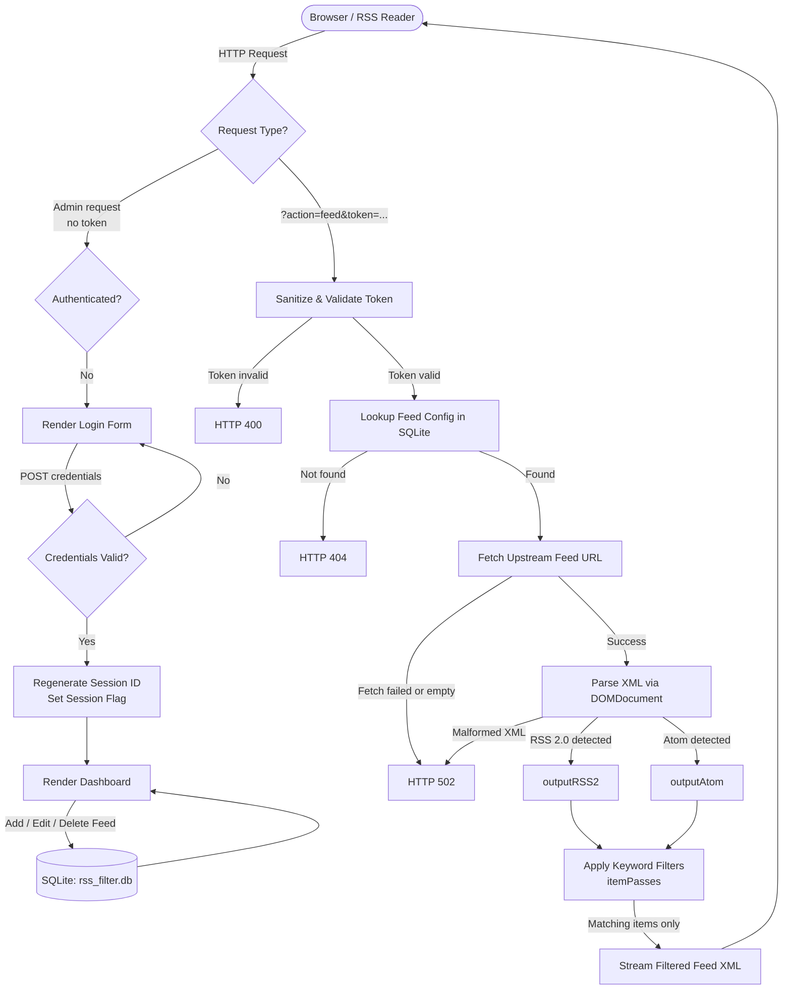

# xsukax RSS Filter

> A self-hosted, single-file PHP RSS feed filtering service with keyword-based item filtering, SQLite persistence, session authentication, and support for both RSS 2.0 and Atom formats.

[](https://www.gnu.org/licenses/gpl-3.0)
[](https://www.php.net/)
[](https://github.com/xsukax/xsukax-RSS-Filter)

---

## Table of Contents

- [Project Overview](#project-overview)
- [Security and Privacy Benefits](#security-and-privacy-benefits)
- [Features and Advantages](#features-and-advantages)
- [Installation Instructions](#installation-instructions)
- [php.ini Configuration](#phpini-configuration)
- [Usage Guide](#usage-guide)
- [Architecture Diagram](#architecture-diagram)
- [Filtering Logic Reference](#filtering-logic-reference)
- [License](#license)

---

## Project Overview

**xsukax RSS Filter** is a lightweight, self-hosted RSS/Atom feed proxy and filtering service contained entirely within a single file — `index.php`. It fetches RSS 2.0 and Atom feeds from upstream sources, applies user-defined keyword filters against item titles and descriptions, and re-serves the filtered output as a valid, standards-compliant RSS or Atom feed that any feed reader can subscribe to.

The application is managed through a protected web dashboard where administrators can add, edit, and delete feed configurations. Each configured feed receives a unique cryptographic token that forms part of its public URL, allowing selective sharing without exposing the admin panel.

This tool is ideal for developers, power users, and organizations who consume high-volume RSS feeds and need precise control over which items reach their readers, all without relying on any third-party service.

---

## Security and Privacy Benefits

Security and privacy are core to xsukax RSS Filter's design. The following measures are built directly into the codebase:

### Authentication & Session Management
- **Session-based authentication** protects the entire admin dashboard. Unauthenticated requests are immediately redirected to a login form.
- **`session_regenerate_id(true)`** is called upon every successful login, preventing session fixation attacks by invalidating the old session ID.
- **`hash_equals()`** is used for credential comparison instead of `==` or `===`, mitigating timing-based side-channel attacks on username and password verification.
- Sessions are cleanly destroyed on logout via `session_destroy()`, leaving no residual authentication state.

### Token-Based Public Feed URLs
- Each feed is assigned a **64-character cryptographically secure token** generated with `bin2hex(random_bytes(32))`. This ensures feed URLs are unguessable.
- The token is sanitized via a strict regex (`[^a-f0-9]`) before any database lookup, preventing injection through token parameters.
- A minimum token length of 16 characters is enforced server-side. Short or malformed tokens receive an HTTP 400 response immediately.

### Input Validation & Sanitization
- All user-supplied URLs are validated with PHP's `FILTER_VALIDATE_URL` before storage. Invalid URLs are rejected with a user-facing error.
- All output rendered to HTML is passed through `htmlspecialchars()` (aliased as `h()`) with `ENT_QUOTES | ENT_SUBSTITUTE` and UTF-8 encoding, comprehensively preventing XSS vulnerabilities.
- All database interactions use **PDO prepared statements with bound parameters**, eliminating SQL injection risks entirely.

### XML Handling
- Upstream feed XML is parsed in a sandboxed manner using `libxml_use_internal_errors(true)` and `DOMDocument->recover = true`, preventing malformed or adversarial XML from crashing the application or leaking internal errors.

### Privacy
- The application is **entirely self-hosted** — no feed data, keywords, or access patterns are transmitted to any external service.
- The SQLite database is stored **one directory above the web root** (`../rss_filter.db` relative to `index.php`), making it inaccessible via direct HTTP requests.
- No tracking, analytics, cookies beyond the session cookie, or third-party scripts are used.

---

## Features and Advantages

- **Single-file deployment** — the entire application is `index.php`. No frameworks, no Composer dependencies, no build steps.
- **RSS 2.0 and Atom support** — automatically detects and processes both major syndication formats, outputting a format-matched filtered feed.
- **Flexible keyword filtering** across three independent channels:
  - **Title Keywords** — match against the item title only.
  - **Description Keywords** — match against the item body/description only.
  - **Both Keywords** — match against either title or description (always OR internally).
- **OR / AND logic toggle** — choose whether keyword groups must all match (AND) or whether any match is sufficient (OR).
- **Pass-through mode** — leaving all keyword fields blank passes every item through, turning the tool into a simple feed proxy.
- **SQLite persistence** — zero-configuration embedded database. No MySQL or PostgreSQL required.
- **WAL journal mode** enabled for improved SQLite concurrency and read performance.
- **In-dashboard copy button** — one-click clipboard copy of the generated filtered feed URL.
- **Edit modal** — feeds can be updated in-place without navigating away from the dashboard.
- **UTF-8 throughout** — all string operations use `mb_*` functions with explicit UTF-8 encoding, ensuring international content is handled correctly.
- **Strict PHP types** — `declare(strict_types=1)` is enforced at the top of the file, reducing type-coercion bugs.

---

## Installation Instructions

### Requirements

| Requirement | Minimum Version |
|---|---|
| PHP | 8.0+ |
| PHP extensions | `pdo`, `pdo_sqlite`, `mbstring`, `libxml`, `dom`, `openssl` |
| Web server | Apache 2.4+ or Nginx 1.18+ |
| File system | Writable directory one level above web root |

### Step 1 — Clone the Repository

```bash
git clone https://github.com/xsukax/xsukax-RSS-Filter.git
cd xsukax-RSS-Filter
```

### Step 2 — Deploy to Web Root

Copy `index.php` into your web-accessible directory, for example `/var/www/html/rss-filter/`:

```bash
cp index.php /var/www/html/rss-filter/
```

### Step 3 — Create the Database Directory

The application stores its SQLite database at `../rss_filter.db` relative to `index.php` — that is, one directory **above** the web root. This keeps the database file out of reach of direct HTTP access.

```bash
# Ensure the parent directory is writable by the web server
chmod 755 /var/www/html/
chown www-data:www-data /var/www/html/
```

The database file (`rss_filter.db`) and its table are created automatically on first run.

### Step 4 — Configure Credentials

Open `index.php` and change the default credentials before going live:

```php
define('AUTH_USER', 'your_username');
define('AUTH_PASS', 'your_secure_password');
```

> ⚠️ **Important:** The default credentials are `admin` / `admin@123`. Change these before exposing the application to any network.

### Step 5 — Configure Your Web Server

**Apache** — place a `.htaccess` in the same directory as `index.php`:

```apache
Options -Indexes
DirectoryIndex index.php

<Files "*.db">
    Require all denied
</Files>
```

**Nginx** — add to your server block:

```nginx
location /rss-filter/ {
    try_files $uri $uri/ /rss-filter/index.php?$query_string;
}

location ~* \.db$ {
    deny all;
}
```

### Step 6 — Verify Installation

Navigate to your deployment URL (e.g., `https://yourdomain.com/rss-filter/`) in a browser. You should see the login page.

---

## php.ini Configuration

The following `php.ini` settings are recommended for optimal operation of xsukax RSS Filter:

```ini
; Minimum required
extension=pdo_sqlite
extension=mbstring
extension=dom

; Session security
session.use_strict_mode = 1
session.cookie_httponly = 1
session.cookie_secure   = 1        ; Requires HTTPS
session.cookie_samesite = Strict
session.gc_maxlifetime  = 1800     ; 30-minute idle timeout

; XML / feed fetching
allow_url_fopen = On               ; Required for fetchURL() via file_get_contents
default_socket_timeout = 15        ; Prevent slow upstream feeds from hanging
user_agent = "xsukax-RSS-Filter/1.0.0"

; Character encoding
default_charset = "UTF-8"
mbstring.internal_encoding = UTF-8

; Error handling (production)
display_errors = Off
log_errors     = On
error_log      = /var/log/php_errors.log

; Upload / memory (adjust to your feed sizes)
memory_limit   = 64M
max_execution_time = 30
```

> **Note on `allow_url_fopen`:** xsukax RSS Filter uses `file_get_contents()` with a stream context to fetch upstream feeds. This requires `allow_url_fopen = On`. If your hosting environment disallows this, you can modify the `fetchURL()` function in `index.php` to use `curl` instead.

---

## Usage Guide

### Logging In

Navigate to the application URL. Enter the credentials defined in `index.php` under `AUTH_USER` and `AUTH_PASS`.

### Adding a Feed

1. In the **Add New Feed** section at the top of the dashboard, fill in:
   - **Feed Name** *(required)* — a human-readable label for internal reference.
   - **Feed URL** *(required)* — the full URL to the upstream RSS 2.0 or Atom feed.
   - **Title Keywords** *(optional)* — comma-separated terms matched against item titles.
   - **Description Keywords** *(optional)* — comma-separated terms matched against item descriptions.
   - **Both Keywords** *(optional)* — comma-separated terms matched against titles **or** descriptions.
   - **Logic Toggle** — select **OR** (any group matches) or **AND** (all groups must match).
2. Click **Add Feed**.

### Subscribing to a Filtered Feed

After a feed is added, the **Filtered Feed URL** column in the table shows the public URL for that feed. This URL contains the feed's unique token. Copy it using the **Copy** button and paste it into your RSS reader as a new subscription.

### Editing a Feed

Click the **Edit** button next to any feed in the table. An inline modal will open pre-populated with the feed's current configuration. Modify any fields and click **Save Changes**.

### Deleting a Feed

Click the **Delete** button next to a feed and confirm the prompt. The feed and its token are permanently removed from the database.

### Logging Out

Click the **Logout** button in the navigation bar. Your session is immediately destroyed.

---

## Architecture Diagram

The following diagram illustrates the overall request flow through xsukax RSS Filter:



---

## Filtering Logic Reference

The table below summarises how keyword groups and the OR/AND toggle interact:

| Title KW | Desc KW | Both KW | Logic | Item passes if…                                              |
|----------|---------|---------|-------|--------------------------------------------------------------|
| ✓        |         |         | OR/AND | Title matches any Title KW                                  |
|          | ✓       |         | OR/AND | Description matches any Desc KW                             |
| ✓        | ✓       |         | OR    | Title **or** Description matches their respective KW list   |
| ✓        | ✓       |         | AND   | Title **and** Description both match their respective KW lists |
|          |         | ✓       | any   | Title **or** Description matches any Both KW (always OR)    |
|          |         |         | any   | All items pass (pass-through mode)                          |

> **Both Keywords** always use OR internally and are unaffected by the OR/AND logic toggle. They evaluate independently and their result is combined with the other groups using the selected logic.

---

## License

This project is licensed under the **GNU General Public License v3.0** — see [https://www.gnu.org/licenses/gpl-3.0.html](https://www.gnu.org/licenses/gpl-3.0.html) for the full license text.
